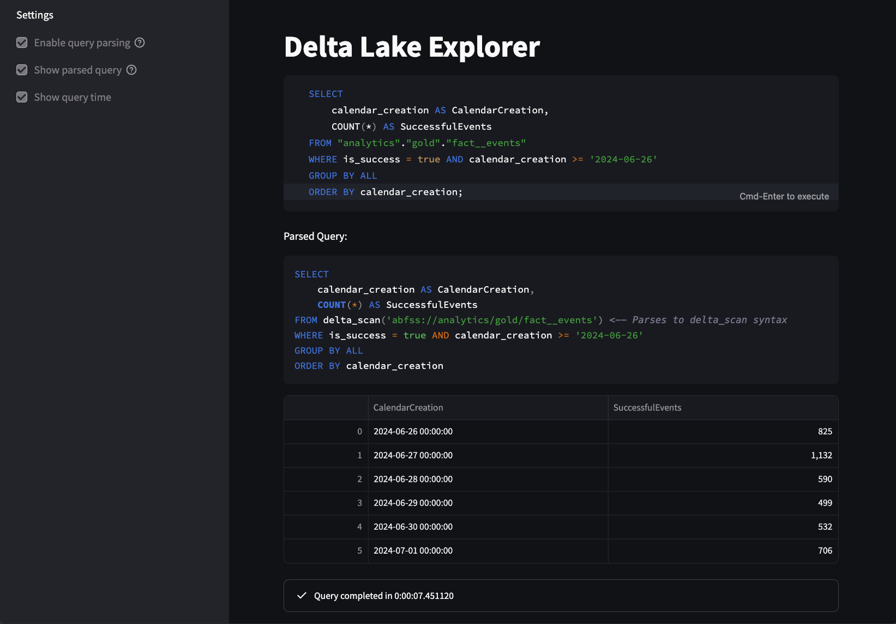

# Delta Lake Explorer

Delta Lake Explorer is a Streamlit application that allows users to explore Delta Lake tables on Azure Data Lake Storage using DuckDB. The application provides a code editor for writing SQL queries, a sidebar for configuring settings, and a result viewer for displaying query results.

## Screenshots



## Features

- **Code Editor**: Write and execute SQL queries.
- **Query Parsing**: Automatically parse and transform queries to use `delta_scan`.
- **Query Timing**: Display the time taken to execute queries.

## Installation

1. Clone the repository:


```bash
git clone https://github.com/mrjsj/delta-lake-explorer.git
cd delta-lake-explorer
```

2. Create a virtual environment:

```bash
python -m venv .venv
source .venv/bin/activate # On Windows, use .venv\Scripts\activate
```

3. Install the required packages:

```bash
pip install -r requirements.txt
```

## Configuration

1. Rename the `.streamlit/secrets-template.toml` to `.streamlit/secrets.toml`:

2. Fill in the following values in `.streamlit/secrets.toml`:
    - `STORAGE_ACCOUNT_NAME`: The name of your Azure storage account.
    - `DELTA_LAKE_ROOT_PATH`: The root path up until the delta lake catalog. This includes the container name and the path to the delta lake catalog. E.g., if the full delta table path is `abfss://container/path/to/catalog/layer/table`, then the root path is `container/path/to`. If the delta lake catalog is at the root of the storage account, then the root path is an empty string.

3. Choose a way to authenticate to Azure. You can use a service principal, or a Azure CLI login. In either case, make sure you have at least **Storage Blob Data Reader** role assigned to your service principal or your personal user on the storage account.
    - If you choose a service principal, fill in the following values in `.streamlit/secrets.toml`:
        - `AZURE_TENANT_ID`: The tenant ID of your Azure AD.
        - `AZURE_CLIENT_ID`: The client ID of your service principal.
        - `AZURE_CLIENT_SECRET`: The client secret of your service principal.
    - If you choose Azure CLI login, run `az login` before running the application.

## Usage

Run the Streamlit application:

```bash
streamlit run main.py
```

Query using DuckDB syntax. Tables must be refences by `catalog.schema.table`, e.g.:
```sql
SELECT * FROM catalog.schema.table;
```

For more information on DuckDB syntax, see the [DuckDB documentation](https://duckdb.org/docs/sql/introduction).

## License

This project is licensed under the MIT License. See the [LICENSE](LICENSE) file for details.